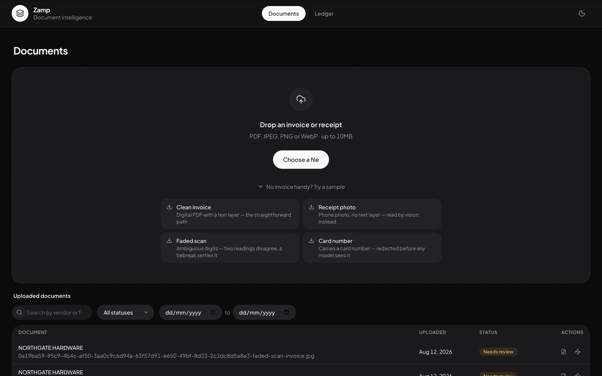
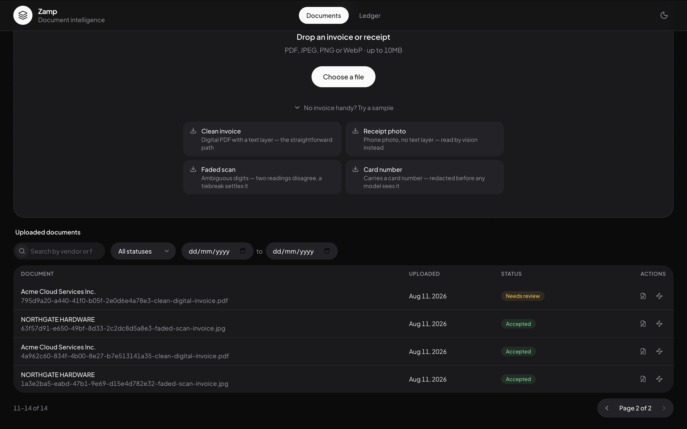

[← Back to overview](index.md)

# Architecture

## One app, not a frontend and a backend

Zamp is a single Next.js application. App Router pages and API routes live in
the same codebase and deploy together — there's no separate frontend
repository talking to a separate backend service, and nothing to run in two
terminals during development.

That's not a shortcut; it's a deliberate call. A standalone Node/Express API
was considered and rejected: Next.js API routes already give a serverless
backend with no separate service to stand up, one deployed URL serves both
the UI and the API, and it keeps local setup to one `npm run dev`.

```
src/
├── app/               # Routing layer — pages + API endpoints, kept thin
│   └── api/           #   HTTP only: parse request → call a service → shape response
├── components/        # Presentation layer
│   ├── ui/            #   Design system — generic, knows nothing about invoices
│   ├── domain/        #   Shared across features, meaningless outside this product
│   └── layout/        #   App shell, navigation
├── features/          # Feature layer — api + hooks + types per feature
├── config/            # Client env + feature flags
├── constants/         # Client-side constants (routes, UI enums, copy)
├── lib/               # API client, query client, observability, utils
├── server/            # Backend layer — never imported by client code
│   ├── services/      #   Business logic (ingestion, review, query, conversations)
│   ├── constants/     #   Enums + config + user-facing messages, single source of truth
│   ├── db/            #   Drizzle schema + client + SQL migrations
│   ├── storage/       #   File storage drivers (local disk / Vercel Blob)
│   ├── llm/           #   Model router, extraction, query translation
│   ├── ingest/        #   File-kind detection (digital PDF vs. scan vs. image)
│   └── confidence/    #   Field-level confidence engine (signals + reasons)
└── middleware.ts      # Anonymous per-browser workspace cookie
```

The organizing rule: **a reviewer should be able to find any concern in one
guess, and the seams should be where the system would actually grow.** A new
document type touches `ingest/` and `llm/`. A new confidence signal is one
module in `confidence/`. A new storage backend is one driver file. Moving
ingestion onto a background queue later means calling the same service from a
worker instead of from the API route, not rewriting it.

API routes are deliberately thin — they parse and validate the request, call
a service function, and shape the response. All real logic (the entire
ingestion flow, for example) lives in `server/services/`, which keeps it
testable without spinning up HTTP at all.

## Deploy-anywhere, on purpose

The app runs on Vercel, but nothing in the core code is Vercel-specific.
Standard Next.js runs on any Node host; the database is any Postgres via a
plain `DATABASE_URL`; file storage always goes through a small driver
interface — local disk by default, Vercel Blob only if a token is configured.
Vercel-specific surface area is confined to one config value (`maxDuration`
on a couple of routes) and one optional storage driver. See
[Local-first setup](08-scope-and-tradeoffs.md#local-first-no-vercel-dependency-to-run-it)
for why this mattered enough to build deliberately.

## The system, end to end

```
                         ┌─────────────────────────┐
   Upload (PDF/image) →  │  Ingestion pipeline      │
                         │  detect → read → verify  │  →  extracted + scored fields
                         │  → tiebreak → score      │
                         └─────────────────────────┘
                                     │
                                     ▼
                         ┌─────────────────────────┐
                         │  Review (human-in-loop)  │  → accept / correct / reject
                         └─────────────────────────┘
                                     │
                                     ▼
                         ┌─────────────────────────┐
                         │  Ledger (accepted data)  │  ← only human-verified rows
                         └─────────────────────────┘
                                     │
                                     ▼
                         ┌─────────────────────────┐
                         │  Ask in plain English    │  → NL → filter DSL → SQL
                         └─────────────────────────┘
```

Three views cover exactly two use cases — **[1] upload and review**, and
**[2] ask questions over accepted data**:

1. **Documents** — drop zone, upload progress, and a list of every uploaded
   document with its status (reading / needs review / accepted / failed).
2. **Review** — the extracted fields beside the original document, each field
   individually scored. Fix or confirm, then accept into the ledger.
3. **Ledger** — the table of accepted documents, plus a floating "ask your
   ledger" panel for plain-English questions over it.



Each row is titled by vendor rather than the raw upload filename once it's
been read, with the filename kept as secondary text — the whole point of the
list is being able to tell documents apart at a glance:



## Multi-provider LLM routing

Every LLM call goes through [LangChain](https://js.langchain.com)'s unified
chat-model interface, not three hand-written provider SDK integrations. That
buys one calling convention and one error-handling path across Google,
OpenAI, and Anthropic, for close to zero integration cost per provider.

**Only one provider key is required to run the app.** At startup, the app
reads whichever provider keys are present and asks each provider's API what
models that specific account can actually reach — see
[`server/llm/capabilities.ts`](https://github.com/Sagarnaikg/zamp/blob/main/src/server/llm/capabilities.ts) —
rather than hardcoding model IDs, which get retired or restricted per-account
without notice (this happened twice during development; see
[Engineering decisions](07-engineering-decisions.md)).

```ts
export interface ProviderCapability {
  provider: Provider;
  apiKey: string;
  cheap: string;    // cheapest usable model — frequent, simple tasks
  strong: string;    // most capable usable model — vision, second readings
  availableModels: string[];
}
```

With one key, every task routes to that provider, split into a cheap tier
(query translation, first readings of digital PDFs) and a strong tier (vision
extraction, second opinions). With a second provider key present, the
**cross-provider agreement signal** — one of the four confidence signals —
automatically gets stronger, since two genuinely independent readers are more
convincing than one reader checked twice. See
[Confidence engine](04-confidence-engine.md#signal-2-independent-reading-agreement)
for why that distinction matters.

Extending to a fourth provider is a deliberate code change, not a plugin
system — every provider needs its own LangChain integration package regardless,
so a plugin layer would add indirection without removing the actual work. The
codebase makes that change hard to get wrong instead: `PROVIDERS` and
`PROVIDER_KEY_VARS` are both typed as `Record<Provider, …>`, so extending the
`Provider` union makes the build fail until every required piece is filled
in — the compiler names exactly what's missing.

---

Next: **[Extraction pipeline →](03-extraction-pipeline.md)**
