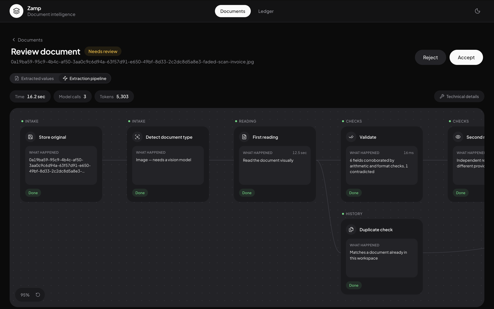

[← Back to overview](index.md)

# The extraction pipeline

Ingestion isn't "call an LLM once, save the JSON." It's a small DAG (directed
graph, not a straight line) of stages, because two of them are genuinely
independent of each other and can run in parallel:

```
store → detect → first reading ─┬→ validate → second reading → compare → tiebreak ─┬→ score
                                 └→ duplicate check ─────────────────────────────────┘
```

The duplicate check compares the new document against workspace history and
never looks at either reading, so it fans out right after the first reading
and merges again at scoring. This isn't a diagram drawn after the fact — it's
literally what the pipeline trace records and renders, stage by stage, in the
UI. See [Making the pipeline visible](#making-the-pipeline-visible) below.



## 1. Store, then detect

The uploaded file is saved first (local disk or Vercel Blob, depending on
what's configured — see [Architecture](02-architecture.md#deploy-anywhere-on-purpose)),
so it's never lost even if everything after this fails. Then the file is
classified: a **digital PDF** with a real, extractable text layer, or a
**scan/photo** that needs a vision model.

This classification is the first real routing decision in the system — it
decides whether the first reading goes to a cheap text model or a vision
model, and it later decides whether a second reading is even worth running
(see [cost policy](#spending-model-calls-only-where-they-buy-something) below).

## 2. First reading — and redaction, before it ever leaves the server

Before a digital PDF's text is sent to any LLM provider, it passes through a
narrow, checksum-based redaction pass: credit/debit card numbers (Luhn
checksum) and IBANs (ISO 7064 checksum) get masked in place —
`•••• •••• •••• 4417` — before the prompt is built. The same masking runs
again on every extracted value after extraction, which is what covers the
vision path too (there's no text to scan before a model reads pixels, so
post-extraction masking is the only point where that path can be protected at
all).

The pattern set is deliberately narrow. A generic "long digit string" rule was
considered and rejected — without a checksum to validate against, it would
misfire on invoice numbers and PO numbers, which is a worse bug than the one
this exists to prevent. `INV-7734` is three digits short of a card number and
fails the Luhn check; it's left alone.

```ts
// src/server/security/redact.ts
function luhnValid(digits: string): boolean {
  let sum = 0;
  let double = false;
  for (let i = digits.length - 1; i >= 0; i--) {
    let d = digits.charCodeAt(i) - 48;
    if (double) { d *= 2; if (d > 9) d -= 9; }
    sum += d;
    double = !double;
  }
  return sum % 10 === 0;
}
```

## 3. Validate

Deterministic checks run against the first reading: does the document's own
arithmetic reconcile (line items sum to subtotal, subtotal plus tax equals
total), do dates parse and land in the past, do currency codes exist. These
are cheap, instant, and explainable — and they catch things no amount of
model agreement ever would, because two independent readings can agree on a
total that simply doesn't match the document's own line items.

## 4. Second reading — only when it earns its cost

A second, independent reading of the document doesn't run unconditionally.

```ts
// src/server/confidence/policy.ts
export function needsSecondReading(
  kind: FileKind,
  firstPass: ConfidenceResult,
): boolean {
  if (kind !== FileKind.DigitalPdf) return true;
  if (firstPass.flaggedCount > 0) return true;
  return !MONEY_FIELDS.every(
    (field) => (firstPass.fieldMeta[field]?.confidence ?? 0) >= CONFIDENCE.verified,
  );
}
```

**Scans and photos always get a second reading** — OCR-style misreads are the
dominant failure mode on pixels, and there's no cheaper independent evidence
to lean on instead. **A digital PDF only gets one if something's already in
doubt** — its text layer is exact characters, so the "model misread a digit"
failure mode barely exists there, and if the document's own arithmetic
already reconciles, that's stronger evidence than paying for a second model's
opinion. Measured on real documents, this roughly halves the model-call cost
on clean digital PDFs with zero new review work created — see
[Engineering decisions](07-engineering-decisions.md#llm-cost) for the numbers.

When a second reading does run, independence comes from whichever the
environment can actually offer, in priority order: a **different provider**
when a second API key is configured (the strongest independence), otherwise
the **same provider with a different model tier and a different input
modality** — for a digital PDF, the primary reads the extracted text while
the second reading reads the rendered page visually. The reasoning: a plain
re-run of the same model on the same input mostly reproduces its own
mistakes, because the errors are correlated. Two different pipelines over two
different representations of the same document fail in genuinely different
ways — closer to two reviewers reading the document differently than one
person reading it twice.

## 5. Compare, then tiebreak — the escalation ladder

If two readings ran, they're compared field by field. Agreement is evidence
in itself; disagreement marks a field **disputed**, not wrong — the system
doesn't yet know which reading is right.

A disputed field doesn't go straight to a human. It goes through one more
**focused, blind re-read**: a third call, narrowed to just the disputed
fields, that is never shown either of the two conflicting values. Majority
voting then decides — if the third reading agrees with the second, the
stored value is corrected and the reviewer is told it changed, rather than
that happening silently. Only a field still unresolved after this reaches a
human, with every candidate value shown.

The third reading is kept deliberately blind on purpose: showing it the two
disputed values would invite it to rubber-stamp whichever looks more
plausible, and then its "agreement" would mean nothing. An independent third
opinion is the only kind worth having.

This is the "don't spend a human's attention on something a machine can check
itself" principle, and it's what makes the review queue mean something — a
field reaching a human now means *the system genuinely couldn't resolve
this*, not *the first two guesses happened to differ*.

## 6. Duplicate check

Runs in parallel with verification, comparing the new document against
workspace history on vendor, invoice number, amount, and date — exact match
for identical resubmissions, fuzzy match for near-misses. Duplicate invoices
are a real, documented money problem in accounts payable; catching one before
it's paid is close to free here since the fields it needs are already being
extracted anyway.

## 7. Score

Everything above feeds the confidence engine, covered in full in
**[Confidence engine](04-confidence-engine.md)** — this is where the four
signals (arithmetic, format, agreement, duplicates) combine into a
field-by-field confidence score and a plain-English reason for each.

## Spending model calls only where they buy something

Beyond the adaptive second reading above, three more cost decisions, measured
rather than assumed:

- **The second reading uses a reduced schema.** It exists only to be compared
  field by field against eight scalar values — it doesn't re-extract line
  items or extra fields that would just be parsed and discarded. Output
  tokens scale with line count, so this saves the most on the biggest
  invoices.
- **Long PDF text is clamped**, keeping the head and tail (where vendor,
  invoice number, date, and totals actually live) rather than paying for
  everything in between.
- **Region-cropping was tried and reverted.** The idea — send only the part
  of the page a disputed field lives in, to save tokens and get a more
  focused read — measured *worse* on every image size tested, with zero
  accuracy gain. See [Engineering decisions](07-engineering-decisions.md#region-cropping-tried-measured-reverted)
  for why, and for the finding worth keeping from the experiment.

## Making the pipeline visible

Every decision above — which stages ran, which were skipped and why, which
model read the document, what it cost — is recorded and returned as a graph:
`{ nodes, edges, totals }`. It's rendered in the review UI exactly as the DAG
at the top of this page, pannable and zoomable.

A **skipped** stage is kept in the trace with its reason, not hidden — "we
chose not to spend a model call here, because the arithmetic already
reconciled" is more informative than silence, and it's the honest way to
surface the cost optimization above rather than making it invisible.

Model names and per-step token counts sit behind a "Technical details" toggle
in the UI, off by default — useful for an audit trail, not what a finance
reviewer needs to decide whether to trust a number.

---

Next: **[Confidence engine →](04-confidence-engine.md)**
