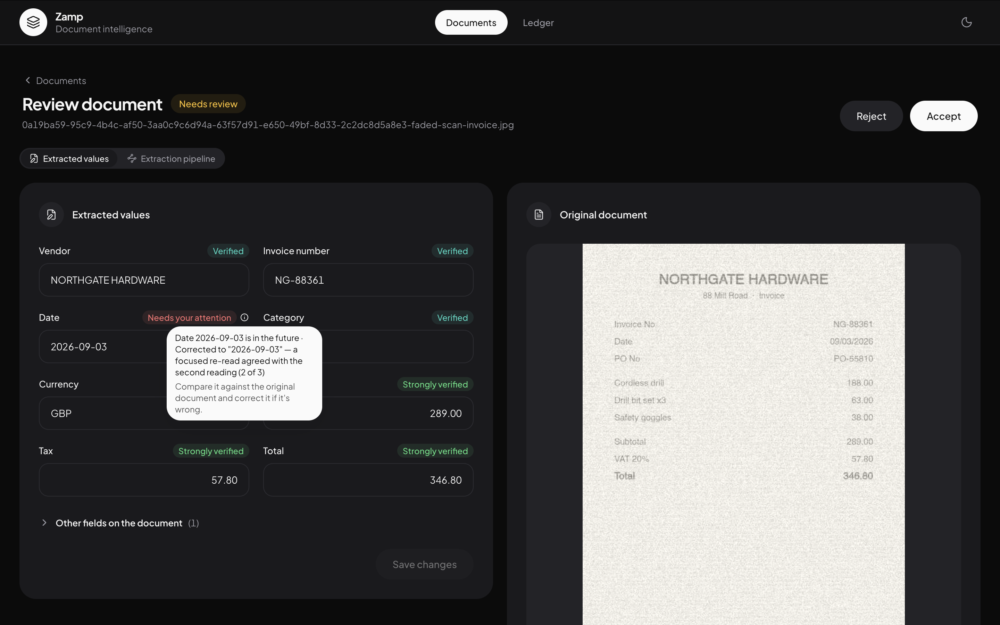

[← Back to overview](index.md)

# The confidence engine

This is the actual centerpiece of the project — the part described in
[Problem & scope](01-problem-and-scope.md) as the hard sub-problem worth
going deep on. Everything else exists to feed it or to act on what it
decides.



## Why not just ask the model how confident it is?

Because it's a known-bad idea. LLM self-reported confidence is notoriously
miscalibrated — a model will happily report 0.95 on a value it hallucinated,
because it isn't actually reasoning about its own uncertainty, it's producing
another token that looks plausible in context. Coloring cells by a
self-reported number would have been a prompt tweak dressed up as a solved
problem.

Instead, every field's confidence comes from **evidence that can be
independently checked**, combined from four signals.

## The four signals

### Signal 1: arithmetic consistency

The strongest signal available, because it's independently verifiable and it
localizes *which* field is wrong instead of just flagging the whole document.
Line items must sum to the subtotal; subtotal plus tax must equal the total.

```ts
// src/server/confidence/arithmetic.ts
if (itemsMatchSubtotal === false) {
  findings.push({
    field: ExtractionField.Subtotal,
    kind: FindingKind.Suspect,
    reason: `Line items sum to ${sumStr} but subtotal reads ${subStr}` +
            (looksLikeDigitSwap(itemSum, subtotal) ? " (possible digit swap)" : ""),
  });
}
```

Notice the reason is a full sentence, not a code — `"possible digit swap"` is
detected by literally checking whether the two numbers are the same digits in
a different order, because that's a genuinely common misread and worth
naming specifically rather than leaving the reviewer to guess.

### Signal 2: independent-reading agreement

The document is read twice, and the two readings are compared field by
field — a second reviewer checking the first one's work, rather than the
same reviewer reading it twice. Agreement raises confidence; disagreement
flags the field and both readings are recorded so a human (or the tiebreak
step) can see exactly where they diverged.

Independence matters here specifically because two runs of the *same* model
on the *same* input tend to reproduce the same mistake — the errors are
correlated, not independent. See
[Extraction pipeline → second reading](03-extraction-pipeline.md#4-second-reading--only-when-it-earns-its-cost)
for how independence is obtained with only one provider key configured, and
why a second key strengthens this signal specifically.

### Signal 3: format and plausibility

Dates that parse and aren't in the future, currency codes that actually
exist, totals that aren't negative. Cheap, deterministic, and catches
"August" being misread as a date field that's technically valid but
impossible.

### Signal 4: duplicate detection

Every incoming document is compared against workspace history on vendor,
invoice number, amount, and date — exact match for identical resubmissions,
fuzzy match for near-misses — and flagged before it ever enters the
queryable dataset. This is close to free to add, since the fields it needs
are already being extracted for the fixed schema anyway, and duplicate
invoices are a real, documented money problem in accounts payable, not a
hypothetical one.

## From signals to a score

Each field collects **findings** — a signal either confirms it, disputes it
(a "suspect" finding, with a reason), or reports it missing. The rule for
turning that into a bucket:

```ts
// src/server/confidence/engine.ts
if (suspects.length > 0) {
  // Both halves matter: "we changed this, and it still looks wrong."
  confidence = CONFIDENCE.suspect;
  reasons = reasonsOf([...suspects, ...confirms]);
} else if (missing) {
  confidence = CONFIDENCE.missing;
  reasons = [FIELD_REASONS.notFound];
} else {
  // More independent confirmations → higher confidence.
  confidence = scoreFrom(confirms.length);
  reasons = reasonsOf(confirms);
}
```

Any suspect finding wins outright, regardless of how many other signals
confirmed the field — one piece of contradicting evidence is treated as more
important than several pieces of supporting evidence, on purpose. A field
with zero independent confirmations sits at "unverified," not a false
"verified" — the badge is honest about weak evidence rather than defaulting
to reassuring.

The buckets a reviewer actually sees, from the label mapping:

| Bucket | What it means |
|---|---|
| **You confirmed this** | A human corrected it — this is now ground truth, not a guess. |
| **Strongly verified** | Multiple independent signals confirm it. |
| **Verified** | One independent signal confirms it. |
| **Unverified** | Nothing independently confirms it, but nothing contradicts it either. |
| **Needs your attention** | At least one signal actively disputes it. |
| **Not found** | The document doesn't appear to contain this field. |

Every badge that has something more to say shows a small info icon — hover
or focus it, and it explains both the specific reason ("Date 2026-09-03 is in
the future") *and* what to actually do about it ("Compare it against the
original document and correct it if it's wrong"). Stating that a field is
wrong without saying what to check next would just move the trust problem
from the model onto the UI.

## The escalation ladder, restated

The full flow from "two readings" to "a human sees this" is covered in detail
in [Extraction pipeline](03-extraction-pipeline.md#5-compare-then-tiebreak--the-escalation-ladder) —
worth restating here because it's the mechanism that keeps the review queue
meaningful: deterministic checks run first (free and instant), then a
focused blind re-read settles most genuine disagreements automatically, and
only what's still unresolved after that reaches a human. A flagged field
means the system actually couldn't resolve it — not that the first two
guesses happened to differ.

## Correcting a field is a real, audited action

Only fields the reviewer actually touched are ever submitted — untouched
fields aren't resubmitted with their existing value, because doing so would
forge a human verification that never happened. Every correction writes an
audit-log entry (old value, new value, timestamp) and pins that field's
confidence to "you confirmed this." History isn't overwritten — it's a
append-only trail of what changed and when.

## Accepting a document doesn't require every field to be clean

A document can be accepted with a field still flagged — the confirm dialog
that appears explains what's still unresolved and that accepting won't fix
it, but it doesn't block the action outright. The alternative (a hard block)
would mean a document with one genuinely unresolvable field — the currency
really isn't printed anywhere, say — could never be accepted at all. The
confirmation is the middle ground: never silent, never a dead end.

---

Next: **[Database design →](05-database-design.md)**
