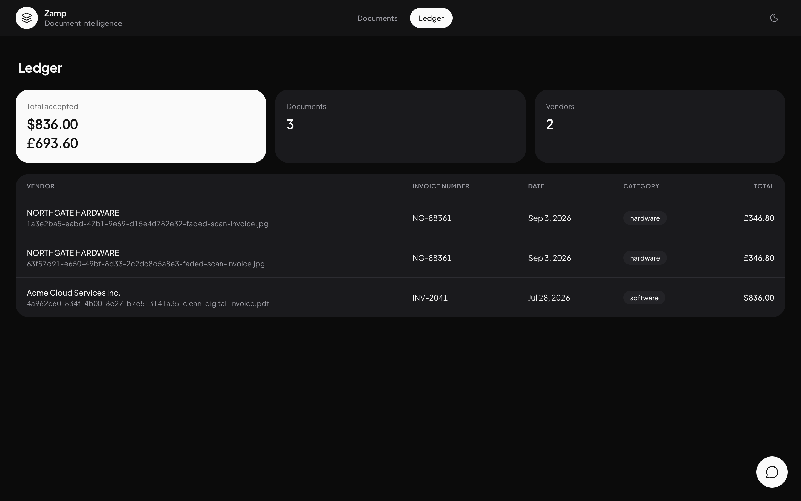

[← Back to overview](index.md)

# Database design

## Postgres, no vector database

The natural instinct for an "AI + documents" project is to reach for a vector
database. That was considered and rejected. The actual query patterns here —
"total spend on software in July," "everything from Acme over $500" — are
filter-and-aggregate over structured fields, exactly what SQL does and
exactly what vector similarity search *can't* do (vector stores don't sum,
group, or range-filter numeric columns well).

The important realization: once a document is extracted, the data isn't messy
text anymore — it's typed rows. Fuzzy text matching for vendor-name typos is
covered by Postgres's `ILIKE`. If semantic search over line items were ever
genuinely needed later, `pgvector` lives inside Postgres — there's no second
datastore to introduce either way.

[Drizzle ORM](https://orm.drizzle.team) was chosen over Prisma for the same
reason threaded through a lot of this project's tooling choices: it keeps the
schema in plain TypeScript, generates readable SQL migration files instead of
a black-box engine, and adds no code-generation step to `npm install` — fewer
moving parts for anyone cloning the repo.

## The schema

```ts
// src/server/db/schema.ts (trimmed for readability)

export const documents = pgTable("documents", {
  id: uuid("id").primaryKey().defaultRandom(),
  workspaceId: text("workspace_id").notNull(),
  filename: text("filename").notNull(),
  fileKind: fileKind("file_kind"),          // digital PDF / scan / image
  storagePath: text("storage_path").notNull(),
  status: documentStatus("status").notNull(),
  pipeline: jsonb("pipeline").$type<StageResult[]>().notNull().default([]),
  // ...timestamps
});

export const extractions = pgTable("extractions", {
  id: uuid("id").primaryKey().defaultRandom(),
  documentId: uuid("document_id").notNull().unique()
    .references(() => documents.id, { onDelete: "cascade" }),
  workspaceId: text("workspace_id").notNull(),
  vendor: text("vendor"),
  invoiceNumber: text("invoice_number"),
  docDate: date("doc_date"),
  currency: text("currency"),
  subtotal: numeric("subtotal", { precision: 14, scale: 2 }),
  tax: numeric("tax", { precision: 14, scale: 2 }),
  total: numeric("total", { precision: 14, scale: 2 }),
  category: text("category"),
  extraFields: jsonb("extra_fields").$type<ExtraField[]>().notNull().default([]),
  fieldMeta: jsonb("field_meta").$type<FieldMeta>().notNull().default({}),
  usage: jsonb("usage").$type<TokenUsage>().notNull(),
  // ...timestamps
});

export const lineItems = pgTable("line_items", {
  id: uuid("id").primaryKey().defaultRandom(),
  documentId: uuid("document_id").notNull()
    .references(() => documents.id, { onDelete: "cascade" }),
  workspaceId: text("workspace_id").notNull(),
  position: integer("position").notNull(),
  description: text("description"),
  quantity: numeric("quantity", { precision: 14, scale: 3 }),
  unitPrice: numeric("unit_price", { precision: 14, scale: 4 }),
  amount: numeric("amount", { precision: 14, scale: 2 }),
});

export const auditLogs = pgTable("audit_logs", {
  id: uuid("id").primaryKey().defaultRandom(),
  documentId: uuid("document_id").notNull()
    .references(() => documents.id, { onDelete: "cascade" }),
  workspaceId: text("workspace_id").notNull(),
  field: text("field").notNull(),
  oldValue: text("old_value"),
  newValue: text("new_value"),
  createdAt: timestamp("created_at", { withTimezone: true }).notNull(),
});
```

Plus `conversations` and `conversation_messages`, covered in
[Natural-language querying](06-natural-language-query.md#conversations-are-persisted-not-replayed-from-memory).



## Why two tables for one document: `documents` and `extractions`

`documents` is one row per upload and owns the file lifecycle — where it's
stored, what kind it is, its status (`processing` → `needs_review` →
`accepted`, or `failed`), and the full pipeline trace. `extractions` is a
one-to-one companion holding what was actually read off the document. They're
split because they change on different schedules and for different reasons:
a document's status changes as it moves through review; its extraction only
changes when a human corrects a field. Keeping them separate also means the
document list endpoint can omit the (larger) pipeline trace at the query
level — it isn't needed there — without touching extraction data at all.

## Two-tier extraction: fixed columns *and* a capture net

The fixed schema (`vendor`, `docDate`, `subtotal`, `tax`, `total`, `category`)
is real typed columns, because the ledger's filtering, summing, and grouping,
and the arithmetic confidence checks, all depend on typed values — a
JSON-path query for every aggregation would be slower and more fragile, the
same reasoning that ruled out a document store over Postgres in the first
place.

But a fixed schema alone silently drops anything outside it — the worst kind
of data loss, because the user has no way to know what was lost. So every
extraction also returns `extra_fields`: everything else clearly labeled on
the document (PO number, due date, payment terms, tax IDs...), captured as
JSONB. It's shown in review and the ledger, but deliberately not
filterable/summable in the same way as the fixed columns — the two mechanisms
answer two different questions ("what can I query?" vs. "did I lose
anything?"), and one column type can't serve both well.

Field keys are normalized so the same concept printed differently across
vendors — `"PO No"`, `"Purchase Order Number"`, `"P.O. #"` — resolves to one
canonical key (`po_number`) for querying, while the label as printed is kept
for display. The model proposes a key (models are good at semantics); a
deterministic alias table settles spelling variants (code is good at
consistency). Genuinely distinct concepts — a GSTIN, a VAT number, a generic
tax ID — are deliberately never merged into one key.

## `field_meta`: confidence lives beside the data, not beside the code

```ts
export interface FieldConfidence {
  confidence: number;
  reasons: string[];
}
export type FieldMeta = Partial<Record<ExtractionField, FieldConfidence>>;
```

One JSONB column on `extractions`, keyed by field, holding the confidence
score and the plain-English reasons behind it — the output of the
[confidence engine](04-confidence-engine.md). It's stored, not recomputed on
every read, so a document's confidence at review time is exactly what
produced the review UI a user saw, not a live recalculation that could drift.

## No `users` table — workspace isolation instead

There's no login and no `users` table. Every table that holds user data
carries a `workspace_id` column instead, populated from an anonymous cookie
set on first visit (see [Scope & trade-offs](08-scope-and-tradeoffs.md#no-login-accounts)
for the full reasoning). Every query is filtered by it. That column is also
exactly where real auth would attach later — swap the cookie-derived id for a
real user id, and the rest of the schema doesn't change.

## Audit logs are append-only

`audit_logs` rows are only ever inserted. Extraction values change when a
human corrects them; the history of *what* changed and *when* doesn't, and
never gets overwritten.

## Conversations store what was asked, not a snapshot of the answer

Covered in full in [Natural-language querying](06-natural-language-query.md),
but worth flagging here at the schema level: `conversation_messages` stores
the filters that ran and the *ids* of the documents that matched — never a
frozen copy of the row data itself. If a matched document is corrected later,
reopening the conversation shows today's value, not a stale one, because the
rows are re-read by id at display time rather than replayed from a saved
copy.

---

Next: **[Natural-language querying →](06-natural-language-query.md)**
