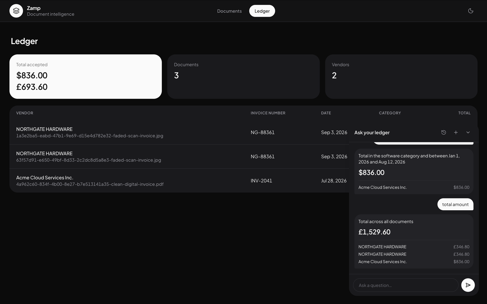

[← Back to overview](index.md)

# Asking the ledger questions in plain English

## Why not chat-only, and why not filters-only

Two simpler designs were both rejected in favor of combining them. A
chat-only interface hides the underlying data and makes it hard to verify
that the system understood the question correctly. Structured filters only
(a table with dropdowns, no natural-language box) is safer but undersells the
actual interesting problem and is more tedious for a real question like "how
much did we spend on software last quarter?"

The chosen design keeps both: the ledger table is always visible as ground
truth, and the natural-language box sits above it. Every answer can be
checked against the table it came from, rather than trusted blind.



## The model never writes SQL

This is the part that matters most for safety. A question never becomes a
raw SQL string, and the model never sees the database. It only ever fills in
a small, fixed, allow-listed structure:

```ts
// src/server/llm/query-translate.ts
const filterSchema = z.object({
  field: z.nativeEnum(QueryField),      // vendor | category | total | doc_date | ...
  key: z.string().nullable(),           // only when field is "extra"
  op: z.nativeEnum(QueryOperator),      // eq | gte | lte | contains | exists
  value: z.string(),
});

const queryDslSchema = z.object({
  filters: z.array(filterSchema),
  aggregate: z.nativeEnum(QueryAggregate),  // none | sum_total | count | avg_total
});
```

The query builder then maps that structure onto typed, parameterized Postgres
columns. An unsafe or malformed query is **structurally impossible** — not
because the prompt says "please don't," but because there's no code path
that turns free-form model output into a raw query string in the first
place.

```ts
// src/server/services/ledger.ts (shape, simplified)
for (const filter of dsl.filters) {
  const condition = filterToCondition(filter);   // → typed Drizzle condition, or null
  if (condition) conditions.push(condition);
  else ignored.push(filter);                     // reported back, never silently dropped
}
```

A filter the builder can't apply — say, a comparison operator over a free-text
extra field, deliberately unsupported because a string comparison there could
give a silently wrong answer — is surfaced back as an `ignoredFilters` entry
and shown to the user, rather than quietly ignored.

## The answer explains itself in the user's own terms

The interpretation shown back to the user — "Total in the software category
and between Jan 1 and Aug 12, 2026" — is built from the filters that
**actually ran**, not from the model restating the question in its own
words:

```ts
// src/server/llm/query-translate.ts
export function describeQuery(
  aggregate: QueryDsl["aggregate"],
  appliedFilters: QueryFilter[],
): string {
  // ...builds a plain-English sentence purely from applied filters
}
```

That distinction is the actual trust mechanism here. If the model
misunderstood the question, that misunderstanding is visible directly in
what the sentence says was searched for — the interpretation *cannot*
misrepresent the query that ran, because it's generated from the query, not
from the model's own account of what it thinks it did.

## Extra fields are queryable too, without letting the model invent keys

The query DSL supports a field called `extra` with `key`, for filtering on
whatever landed in the [capture-net](05-database-design.md#two-tier-extraction-fixed-columns-and-a-capture-net)
JSONB column. The translation prompt is grounded with the distinct keys that
actually exist in that workspace's data, so the model can't invent a key
that was never on any document. Fixed-column queries never touch JSONB at
all, so the common case stays on the fast path — the JSONB query cost is only
paid by questions that actually reference an extra field.

## Conversations are persisted, not replayed from memory

Every question and its answer are recorded into a thread, and a thread
survives a page reload — asking a follow-up doesn't require re-explaining
context.

What's stored is deliberately not a frozen snapshot of the matched rows —
only the filters that ran, the aggregate produced at the time, and the
**ids** of the documents that matched:

```ts
export interface StoredAnswer {
  interpretation: string;
  aggregateKind: QueryAggregate;
  aggregateValue: number | null;
  matchedDocumentIds: string[];
  ignoredFilters: QueryFilter[];
  dsl: QueryDsl;
}
```

Reopening a past conversation re-reads those documents by id at display
time. If one of them was corrected after the question was originally asked,
the reopened thread shows today's value — replaying a stale cached number
would be exactly the kind of quietly-wrong answer the whole product exists to
prevent.

## Asking is a mutation, not a query

On the client, asking a question is a TanStack Query *mutation*, not a
query — deliberately, because a query can fire on mount, on refocus, or on a
cache miss, and every one of those firings would cost a real model call. A
mutation only ever fires when the user actually submits a question.

The UI also treats the question itself as worth showing immediately: it
renders the user's message the instant it's submitted rather than waiting
for the round trip to complete, so there's always a visible record of what
was asked — including if the request fails, in which case the same message
carries a retry action instead of silently disappearing.

---

Next: **[Engineering decisions →](07-engineering-decisions.md)**
