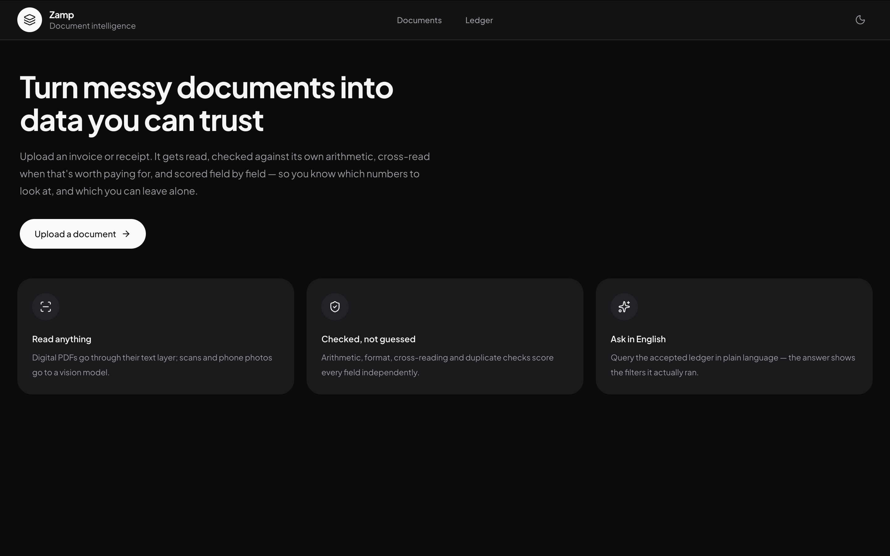

# Zamp: turning messy documents into data you can trust

This is the documentation for Zamp — an invoice/receipt intelligence system that
reads uploaded documents, tells you exactly which extracted values it's sure of
and which ones need a second look, and lets you ask questions about your
accepted documents in plain English.

The [README](https://github.com/Sagarnaikg/zamp#readme) covers how to run the
project. This site covers something different: **what the project actually is**
— the problem it set out to solve, the hard sub-problem it went deep on, how
the pieces fit together, and the decisions (including the ones that didn't pan
out) made while building it.

## Why this exists

Most "AI document extraction" demos stop at "upload a PDF, get JSON back." That
part is genuinely not hard anymore — any current model can read an invoice.
The hard part, and the part a finance person actually cares about, is: **can I
trust the number it gave me, without re-reading the source document myself
every single time?**

No extraction is ever 100% reliable. A trustworthy product has to say so
honestly, field by field, and make it fast to check the ones that are actually
in doubt — instead of either (a) silently returning numbers that might be wrong,
or (b) making the user re-verify everything, which defeats the point of
automating it at all. That's the problem this project is really about, and
it's why the confidence engine — not the extraction call itself — is the
centerpiece.

## Read in this order

1. **[Problem & scope](01-problem-and-scope.md)** — what was being solved, for whom, and what was deliberately left out and why.
2. **[Architecture](02-architecture.md)** — how the system is put together, end to end.
3. **[Extraction pipeline](03-extraction-pipeline.md)** — what actually happens between "upload" and "here are the fields."
4. **[Confidence engine](04-confidence-engine.md)** — the hard sub-problem: how the system decides what to trust.
5. **[Database design](05-database-design.md)** — the schema, and why it looks the way it does.
6. **[Natural-language querying](06-natural-language-query.md)** — asking the ledger questions in plain English, safely.
7. **[Engineering decisions](07-engineering-decisions.md)** — the calls made along the way, including the ones that got reversed.
8. **[Scope & trade-offs](08-scope-and-tradeoffs.md)** — what was deliberately cut (auth, feature flags, and more), and why cutting it was the right call rather than a shortcut.

## The one-paragraph version

Upload an invoice or receipt. It gets read by an LLM, cross-checked against
its own arithmetic, optionally read a second time by an independent model,
and scored field by field — not with the model's own self-reported confidence
(which is unreliable), but from signals that can actually be checked: does the
math add up, does the date parse, do two independent readings agree, has this
document been seen before. Anything genuinely uncertain goes through one more
focused re-read before it's ever shown to a human. You review and correct what
still needs it, accept the document into a ledger, and from there you can ask
it questions in plain English — "how much did we spend on software last
quarter?" — and get back an answer plus exactly which documents and filters
produced it.

Live demo: **[zamp-ten.vercel.app](https://zamp-ten.vercel.app/)**
